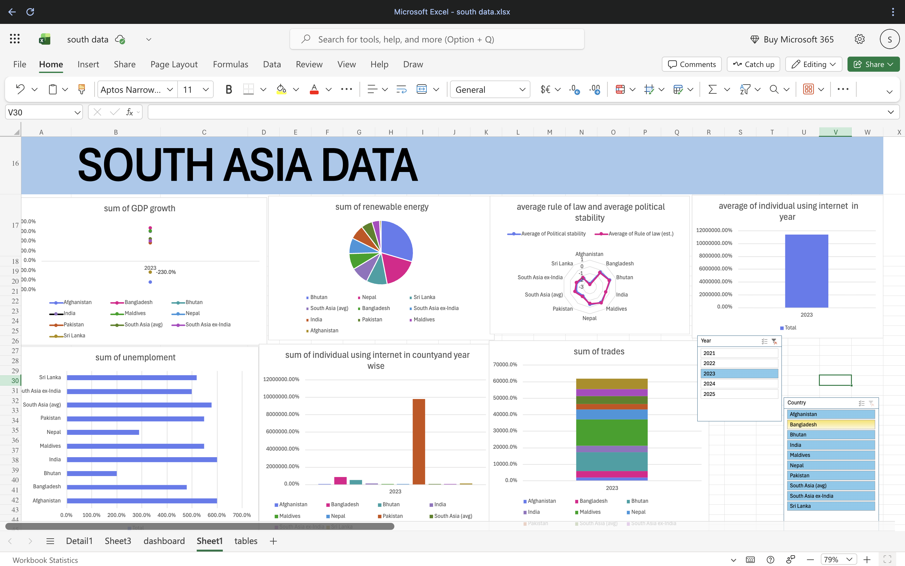

# South-Asia-Sales-Dashboard-Excel

## Dashboard Preview

## Project Overview

This project presents an interactive sales dashboard developed using Microsoft Excel to analyze business performance across South Asian markets. The dashboard transforms raw sales data into meaningful visual insights that support decision-making and business growth.

## Business Objective

The primary objective of this project is to analyze sales performance and identify important business trends across different regions, products, and customer segments.

Key questions explored include:

* Which regions generate the highest sales?
* Which products contribute the most revenue?
* How do sales trends change over time?
* Which customer segments perform best?
* What opportunities exist for business growth?

## Tools & Technologies

* Microsoft Excel
* Pivot Tables
* Pivot Charts
* Slicers
* Data Cleaning
* Data Visualization

## Dashboard Features

* Interactive Filters
* Regional Sales Analysis
* Product Performance Analysis
* Revenue Trends
* Customer Insights
* KPI Monitoring
* Dynamic Visualizations

## Dataset

South Asia Sales Dataset

## Key Insights

* Identified top-performing regions and products.
* Analyzed revenue growth patterns across markets.
* Evaluated customer purchasing behavior.
* Tracked important business KPIs.
* Generated insights to support strategic decision-making.

## Files Included

* Excel Dashboard (.xlsx)
* Sales Dataset (.csv/.xlsx)
* Dashboard Screenshot

## Dashboard Preview
